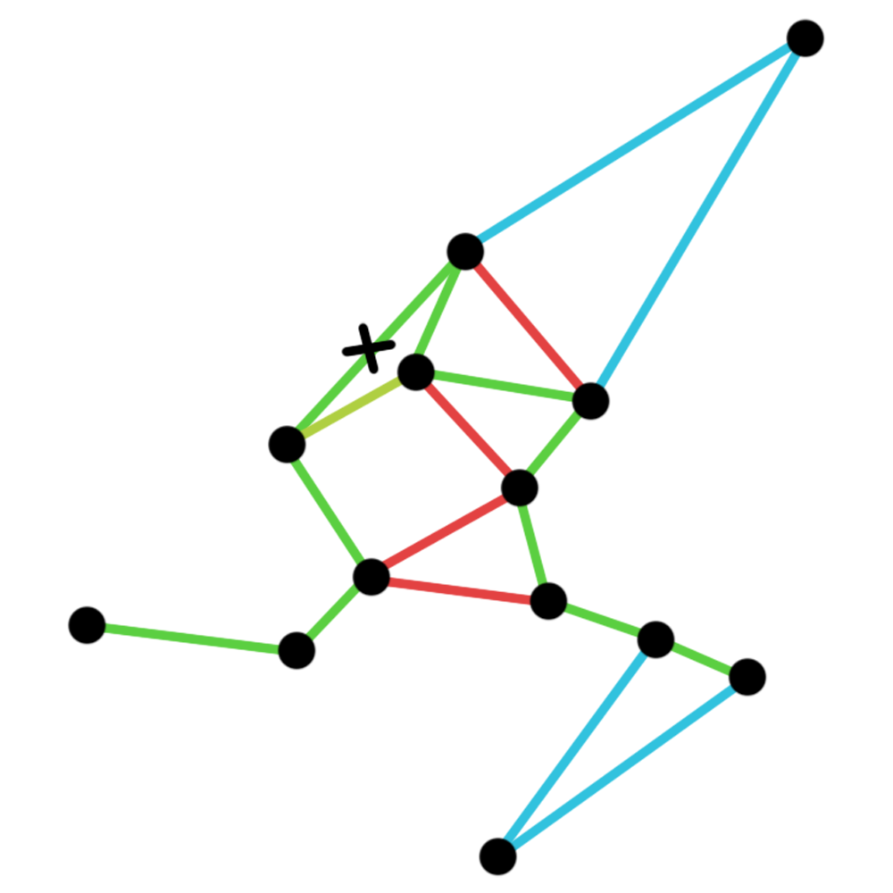
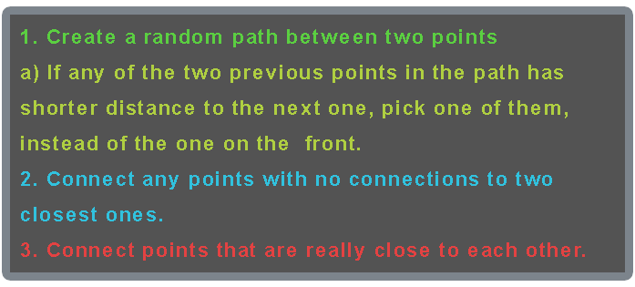

# A* Galaxy Generator
Fully playable in web browser project made inside Godot Engine.  

**[Link to the web project](https://pick65.github.io/AStar-Galaxy-Generator/)**  
Click "**REGENERATE**" and move around the galaxies by pressing on them.  
Play around with different values for the generation.

## Creating galaxies

At the beginning galaxies are generated in the grid, then for every one of them
a unique random "x" and "y" coordinate offset is generated. To prevent the galaxies
from overlapping, a bounding box test is done for every single one of them,
and if any overlaps are found, one of the objects is deleted.

## Creating connections

To create connections, a A* algorithm is used. Thanks to Godot Engine having it built in,
I could skip having to write it myself. Below I have put a simple image that demonstrates
how the algorithm connects the galaxies. 

  

  

